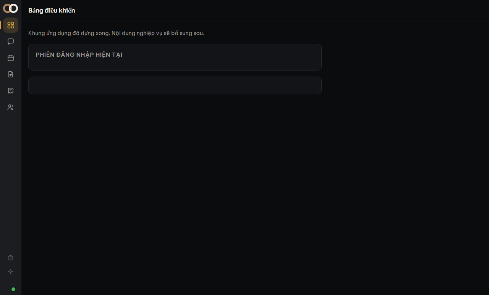

Bạn **không tự đăng ký** vào workspace của công ty. Quản trị viên tạo tài khoản hộ, rồi đưa
bạn một **mật khẩu tạm**.

## Các bước

1. Mở trang đăng nhập của công ty.
2. Điền email công ty và mật khẩu tạm quản trị viên đưa.
3. Hệ thống đưa bạn thẳng tới chỗ đổi mật khẩu — đặt mật khẩu của riêng bạn ngay tại đó.

## Vì sao là mật khẩu tạm chứ không phải lời mời qua email

Hệ thống **chưa nối dịch vụ gửi email**. Làm một luồng nói "đã gửi lời mời" mà thật ra không
gửi gì là kiểu nói dối tệ nhất: bạn ngồi chờ, và không có chỗ nào báo lỗi.

Nên mật khẩu tạm đi qua đường thật của nó — Zalo, tin nhắn, hoặc đưa tận tay. Vì vậy nó cũng
được sinh sao cho **đọc được qua điện thoại**: bảng chữ bỏ `0/O` và `1/l/I`, chia cụm bằng
dấu nối như `k7np-2wqx-hs4m`.

> [!canh] Mật khẩu tạm chỉ sống tới lần đăng nhập đầu tiên. Đổi xong là nó hết tác dụng —
> kể cả với người đã đọc được tin nhắn của bạn.

## Quên mật khẩu thì sao

Hiện **chưa có** luồng tự phục hồi, vì nó cần email. Hãy nhờ quản trị viên vào màn
**Thành viên**, mở chi tiết tài khoản của bạn và bấm *Đặt lại mật khẩu* — bạn sẽ nhận một
mật khẩu tạm mới.

Xem [Đặt lại mật khẩu hộ đồng nghiệp](#dat-lai-mat-khau).
