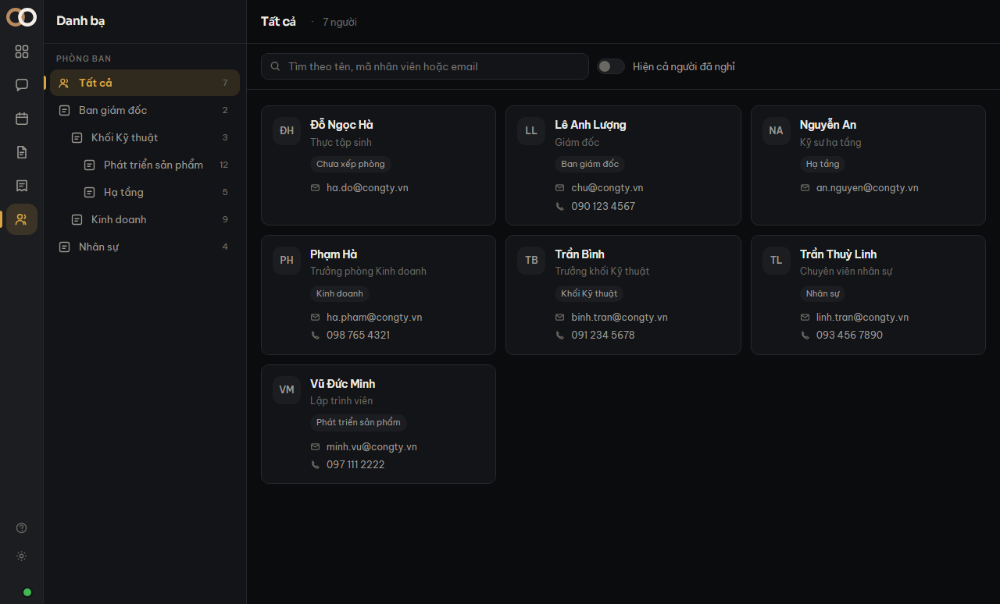

**Danh bạ** là màn tra cứu, ai trong workspace cũng vào được. Nó khác màn **Thành viên** ở
mục đích: Danh bạ để *tìm* đồng nghiệp, Thành viên để *quản lý* họ.

## Tìm

Ô tìm khớp cả **tên**, **mã nhân viên** và **email công việc**. Mã nhân viên nằm trong đó vì
đó là thứ người ta gõ khi tra cứu nhanh — bỏ nó ra thì phải có thêm một ô nữa chỉ để tìm mã.

Gõ tới đâu tìm tới đó, nhưng hệ thống **chờ bạn ngừng gõ** một nhịp rồi mới tìm. Một cái tên
mười ký tự mà tìm theo từng phím là mười lượt đi về.

## Lọc theo phòng ban

Bấm một phòng ở cột trái để chỉ xem người của phòng đó. Bấm lại để bỏ lọc.

## Người đã nghỉ việc

Mặc định danh bạ **chỉ hiện người đang làm**. Hồ sơ người đã nghỉ vẫn còn — bật công tắc
*Hiện cả người đã nghỉ* để xem.

Cố ý ẩn mặc định: hiện họ trong danh bạ nghĩa là đồng nghiệp sẽ gọi điện cho một người không
còn ở đây.

> [!luuy] Thẻ người **bỏ hẳn dòng** nào không có dữ liệu, chứ không vẽ một ô rỗng. Không có
> số điện thoại thì thẻ ngắn hơn, không phải có một dòng trống.
