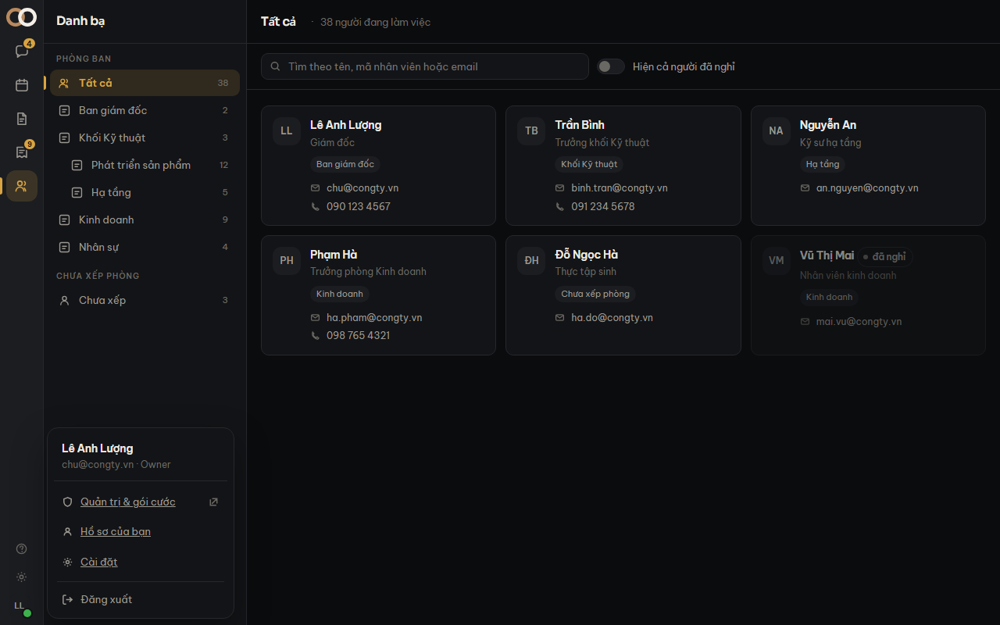

Mở bằng **ảnh đại diện** ở góc dưới bên trái → *Hồ sơ của bạn*.

## Đổi mật khẩu

Thẻ **Bảo mật**. Cần **mật khẩu hiện tại** — đó là thứ ngăn một người ngồi vào máy bạn lúc
đang đăng nhập rồi chiếm hẳn tài khoản.

> [!canh] Đổi mật khẩu xong, **mọi phiên khác bị đăng xuất** — kể cả điện thoại của chính
> bạn. Đó là chủ ý: người đổi mật khẩu vì nghi bị lộ thì cần kẻ kia bị đá ra ngay.

Nếu bạn đang dùng **mật khẩu tạm**, hệ thống đưa bạn thẳng tới thẻ này khi mở màn — bắt tự
đi tìm chỗ đổi thì phần lớn sẽ không đổi.

## Bộ màu

Bốn bộ: ba tối (**Mực**, **Hải đăng**, **Rêu**) và một sáng (**Giấy**).

Mặc định theo cài đặt sáng/tối của máy bạn. Đổi tay thì lựa chọn được nhớ lại — giao diện là
lựa chọn của từng người, giống ngôn ngữ.

Đổi nhanh bằng biểu tượng **bánh răng** ở góc dưới bên trái, không cần mở màn Hồ sơ.

## Ngôn ngữ

Tiếng Việt và tiếng Anh. Đổi ngôn ngữ **không tải lại trang**.

> [!luuy] Tiếng Nhật và tiếng Hàn đã có chỗ trong danh sách nhưng đánh dấu *chưa sẵn sàng*.
> Chúng nằm đó để bạn biết kế hoạch, không phải để bấm.

## Những gì màn này CHƯA có

Ảnh đại diện tải lên, số điện thoại, chức danh, giới thiệu, và danh sách thiết bị đang đăng
nhập — **chưa làm**. Chúng cần những thứ backend chưa có, và vẽ sẵn một công tắc bật được mà
vô tác dụng là kiểu nói dối tệ nhất của giao diện.
