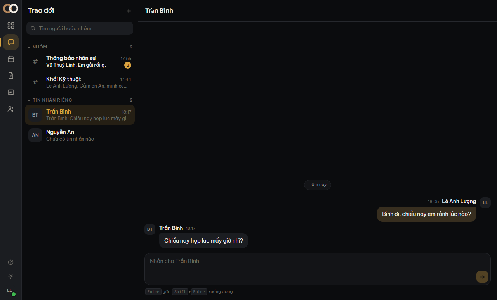

**Trao đổi** là màn mở ra đầu tiên khi bạn vào ONoOffice. Cột trái là mọi hội thoại của bạn,
cột phải là hội thoại đang mở.

## Hai kiểu hội thoại, hai cách đọc

**Tin nhắn riêng** — đúng hai người. Tin của bạn nằm bên phải, tin của người kia bên trái,
giống Zalo.

**Nhóm** — nhiều người, có tên. Mọi tin xếp **một cột bên trái**, giống Slack; tin của bạn
chỉ khác bằng màu nền.

Không phải hai kiểu cho vui: một nhóm mười người mà đảo tin của bạn sang phải thì cột đọc gãy
làm đôi — mắt phải nhảy trái–phải liên tục và không quét được ai nói câu nào.

## Nhắn riêng cho một người

Hội thoại riêng **tự sinh ra khi cần**, bạn không phải tạo nó. Mở **Danh bạ**, tìm người, bấm
*Nhắn tin*. Bấm lần thứ hai vào cùng người đó thì mở lại đúng hội thoại cũ, không đẻ ra cái
mới.

> [!luuy] Hội thoại riêng có **đúng hai người và không đổi được**. Muốn thêm người thì tạo một
> nhóm mới — vì người thứ ba sẽ đọc được toàn bộ những gì hai người đã nói khi tưởng chỉ có hai.

## Tạo nhóm

Bấm dấu **+** ở đầu cột trái, đặt tên nhóm, rồi tick những người muốn mời.

Danh sách mời chỉ hiện **người đã có tài khoản đăng nhập**. Một số đồng nghiệp mới chỉ có hồ
sơ nhân sự mà chưa được cấp tài khoản — họ chưa đăng nhập được thì cũng chưa nhận tin được.
Xem [Nối hồ sơ với tài khoản](noi-ho-so-tai-khoan) nếu bạn cần cấp tài khoản cho ai đó.

Người được thêm vào nhóm **chỉ thấy tin từ lúc họ vào**, không thấy lịch sử trước đó.

## Gửi tin

`Enter` để gửi, `Shift`+`Enter` để xuống dòng.

Câu bạn vừa gõ **hiện ra ngay**, hơi mờ trong lúc đang gửi. Gửi xong thì hết mờ.

Nếu mạng đứt, câu đó **ở lại** với viền đỏ và một nút *Thử lại* — nó không biến mất. Bạn không
phải gõ lại.

## Số chưa đọc

Con số đỏ trên một hội thoại là số tin **của người khác** mà bạn chưa xem. Tin của chính bạn
không bao giờ tính vào đó.

Mở hội thoại ra là con số về 0.

## Những gì màn này CỐ Ý chưa làm

Nói trước để bạn không đợi một thứ không tới:

- **Chưa có báo tin tức thời.** Tin mới của người khác chỉ hiện khi bạn mở lại hội thoại đó
  hoặc chính bạn gửi một câu. Chưa có tiếng chuông, chưa có chấm đỏ nhảy lên giữa chừng.
- **Chưa gửi được tệp và ảnh.**
- **Chưa sửa hoặc xoá được tin đã gửi.**
- **Chưa có thả cảm xúc, trả lời theo chuỗi, hay ghim tin.**

Vì thế màn này cũng **không vẽ "đang gõ…" và không vẽ "đã xem"** — hai thứ đó chỉ đúng khi có
báo tin tức thời, và vẽ chúng ra bây giờ là hứa một điều không có thật.
