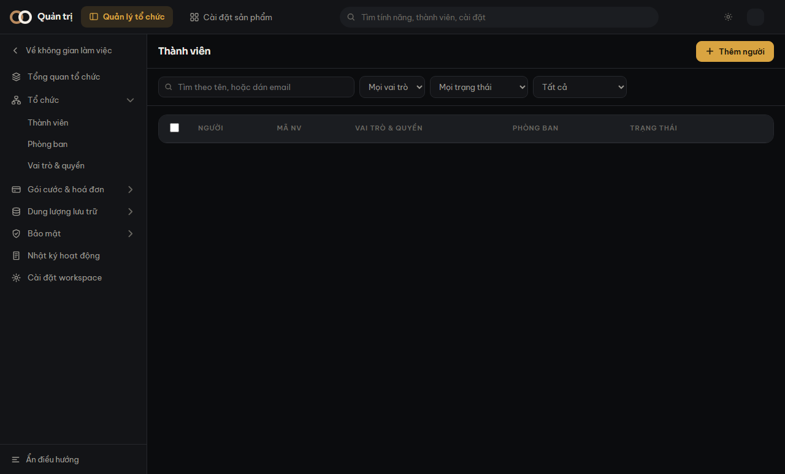

Màn **Thành viên** gộp hai thứ khác nhau vào một bảng:

- **Tài khoản đăng nhập** — thứ dùng để vào hệ thống. Có email, có vai trò.
- **Hồ sơ nhân sự** — thứ phòng nhân sự giữ. Có mã nhân viên, chức danh, phòng ban.

Chúng là hai khái niệm, không phải một. Vì vậy bảng có **ba loại dòng**, và cả ba đều bình
thường.

## Ba loại dòng

| Dòng | Nghĩa là gì |
|---|---|
| Có cả hai | Người bình thường: có hồ sơ, có tài khoản, đã nối với nhau. |
| Chỉ hồ sơ | Nhân viên mới, **chưa được cấp tài khoản**. Cột Vai trò ghi *chưa có tài khoản*. |
| Chỉ tài khoản | Tài khoản máy, hoặc người vừa được cấp tài khoản mà chưa dựng hồ sơ. Cột Mã NV ghi *chưa có hồ sơ*. |

Ô **gạch đứt** trong bảng không phải dữ liệu bị mất. Nó nói đúng một chuyện: phần đó chưa
có, và đó là trạng thái hợp lệ.

> [!luuy] Ô lọc **Lọc theo loại** ở thanh trên lọc đúng hai trạng thái khuyết này. Đó là
> cách nhanh nhất tìm ra ai đang cần cấp tài khoản.

## Vì sao một người có thể hiện ra hai lần

Hệ thống **không tự ghép theo email**. Nếu người này tạo tài khoản còn người kia dựng hồ sơ
mà không ai nối lại, cùng một con người sẽ nằm ở hai dòng — dù email giống hệt nhau.

Tự ghép theo email nghe tiện và sai một cách nguy hiểm: phòng kinh doanh dùng chung
`sales@congty.vn` thì hai người khác nhau bị gộp thành một dòng, và mọi thao tác lên dòng đó
chạm vào nhầm người.

Cách sửa: nối tay. Xem [Nối hồ sơ với tài khoản](#noi-ho-so-tai-khoan).

## Bảng này chỉ ĐỌC từ một chỗ

Mọi thao tác sửa vẫn đi về đúng nơi giữ dữ liệu: đổi vai trò là việc của tài khoản, đổi
phòng ban là việc của hồ sơ. Vì vậy có những dòng không áp được một số thao tác — và màn
hình luôn nói rõ số người bị bỏ qua trước khi bạn xác nhận.
