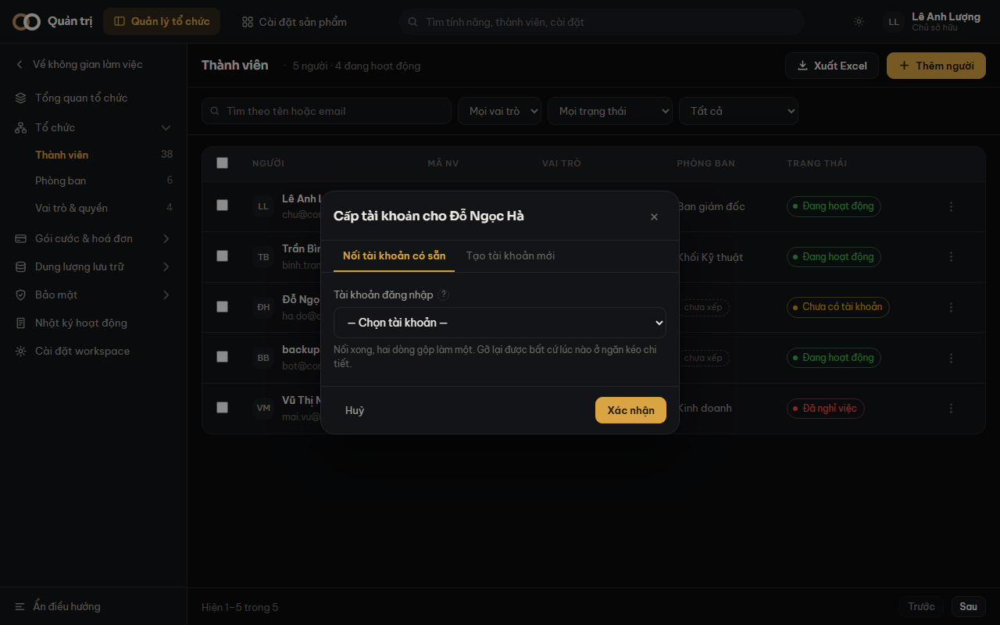

Một dòng còn thiếu nửa kia thì nút **ba chấm** ở cuối dòng mở hộp thoại nối. Hộp này phục vụ
cả hai chiều: đứng ở hồ sơ thì nó hỏi về tài khoản, đứng ở tài khoản thì nó hỏi về hồ sơ.

## Cách 1 — nối vào thứ đã có

Dùng khi cùng một người đang nằm ở hai dòng.

1. Bấm **ba chấm** ở một trong hai dòng.
2. Thẻ **Nối tài khoản có sẵn** (hoặc *Nối hồ sơ có sẵn*).
3. Chọn dòng còn lại trong danh sách xổ.
4. Bấm **Nối**. Hai dòng gộp làm một.

Danh sách xổ chỉ chứa những dòng **chưa nối** của phía kia. Một tài khoản chỉ thuộc về một
người, nên thứ đã có chủ không xuất hiện ở đó.

## Cách 2 — tạo nửa còn thiếu

Dùng khi nửa kia chưa tồn tại ở đâu cả.

1. Bấm **ba chấm**, chọn thẻ **Tạo tài khoản mới** (hoặc *Tạo hồ sơ mới*).
2. Điền phần còn thiếu:
   - Tạo **tài khoản**: email đăng nhập (điền sẵn từ hồ sơ) và vai trò.
   - Tạo **hồ sơ**: mã nhân viên — thứ duy nhất bắt buộc.
3. Bấm **Xác nhận**. Thứ vừa tạo được nối luôn vào dòng bạn đang đứng.

Tạo tài khoản thì bước cuối hiện **mật khẩu tạm** — chép nó ra trước khi đóng hộp thoại.

> [!canh] Mật khẩu tạm chỉ hiện **đúng một lần**. Đóng hộp mà chưa chép thì phải đặt lại
> mật khẩu cho người ta.

## Gỡ liên kết

Nối nhầm người thì mở **chi tiết** dòng đó, tìm khối **Liên kết tài khoản**, bấm
*Gỡ liên kết*. Không mất gì cả: hồ sơ còn nguyên, tài khoản còn nguyên, hai dòng chỉ tách
lại như trước khi nối.

> [!luuy] `LinkAccount` cố ý **không gán đè**. Muốn đổi sang tài khoản khác thì phải gỡ
> trước — một bước cố ý, để một lỗi không lặng lẽ nối hồ sơ người này sang tài khoản người
> khác.
