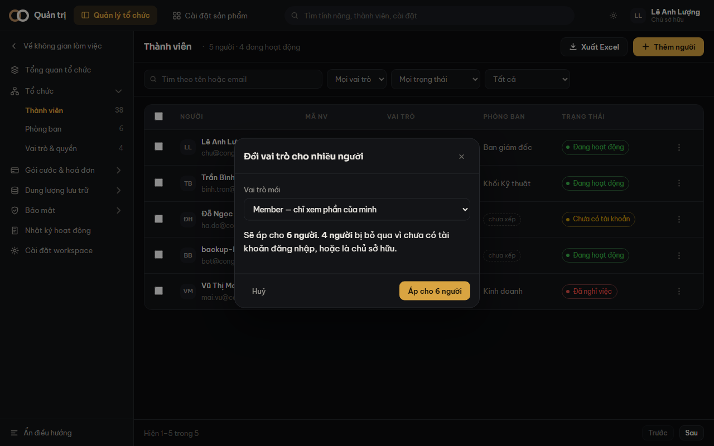

Tick vài dòng trong bảng thì một thanh nổi lên ở đáy màn hình, mang ba việc:
**Đổi phòng ban** · **Đổi vai trò** · **Vô hiệu hoá**.

## Con số quan trọng nhất là con số THỨ HAI

Hộp xác nhận nói hai điều: *"Sẽ áp cho **6 người**. **4 người** bị bỏ qua vì chưa có tài
khoản đăng nhập, hoặc là chủ sở hữu."*

Con số thứ hai mới là thứ cần đọc. Bảng có ba loại dòng, nên một lựa chọn bất kỳ gần như
luôn lẫn cả những dòng không áp được.

| Việc | Cần gì | Ai bị bỏ qua |
|---|---|---|
| Đổi phòng ban | Hồ sơ nhân sự | Dòng chỉ có tài khoản |
| Đổi vai trò | Tài khoản đăng nhập | Dòng chỉ có hồ sơ, và chủ sở hữu |
| Vô hiệu hoá | Tài khoản đăng nhập | Dòng chỉ có hồ sơ, chủ sở hữu, chính bạn, người đã tắt sẵn |

> [!luuy] Nhãn nút mang luôn con số — *"Áp cho 6 người"* chứ không phải *"Xác nhận"*. Thứ
> bạn sắp bấm tự nói ra nó làm gì.

## Chạy tuần tự, và một người hỏng không dừng cả loạt

Hệ thống xử lý **từng người một**, nút hiện *Đang chạy… 4/6*. Nếu một người thất bại, những
người còn lại vẫn được xử lý, và cuối cùng bạn nhận một câu nói thật — *"Đã áp cho 5 người.
1 người thất bại."*

Bắn song song thì nhanh hơn và tệ hơn: hỏng giữa chừng sẽ không có cách nào biết ai đã xong.

## Vài chuyện nên biết

- **Rút khỏi mọi phòng** là một lựa chọn hợp lệ trong ô Phòng ban mới, không phải "chưa
  chọn gì".
- Chạy xong thì hệ thống **tự bỏ chọn**. Giữ nguyên thì cú bấm tiếp theo áp lại lên đúng
  những người đó.
- Chọn chỉ giữ những dòng **đang nhìn thấy**, nên đổi bộ lọc hoặc sang trang là mất lựa
  chọn — cố ý, để thanh "đã chọn 3 người" không bao giờ nói về người bạn không thấy.
