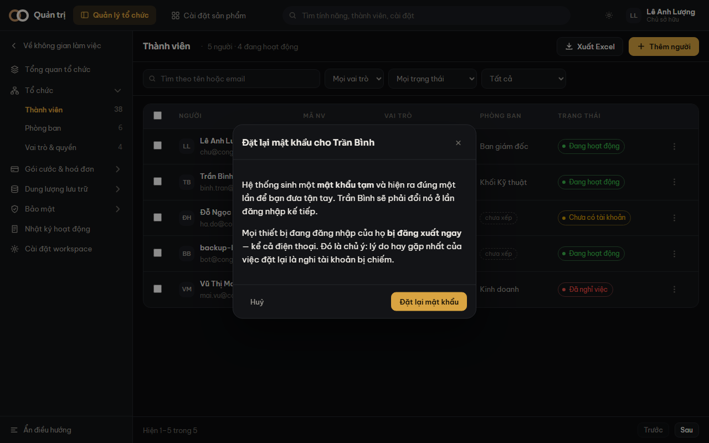

Chưa có dịch vụ gửi email nên **"Quên mật khẩu" ở màn đăng nhập chưa chạy**. Đây là đường
duy nhất để một người bị khoá ngoài quay lại được.

## Các bước

1. Vào **Quản trị → Thành viên**, mở **chi tiết** người cần giúp.
2. Tìm khối **Mật khẩu** (nằm ngay trên vùng nguy hiểm).
3. Bấm **Đặt lại mật khẩu**, đọc kỹ hộp hỏi rồi xác nhận.
4. Chép **mật khẩu tạm** và đưa tận tay cho họ.

## Ba việc xảy ra cùng lúc

1. Mật khẩu cũ bị thay bằng một **mật khẩu tạm**.
2. Người đó **buộc phải đổi** ở lần đăng nhập kế tiếp.
3. **Mọi thiết bị đang đăng nhập của họ bị đăng xuất** — kể cả điện thoại.

Việc thứ ba là chủ ý. Lý do hay gặp nhất của việc đặt lại mật khẩu là **nghi tài khoản bị
chiếm**; không đăng xuất thì kẻ đang ngồi trong phiên cũ vẫn ở nguyên đó, và thao tác này
trông như đã cứu mà không cứu gì.

> [!canh] Hãy báo trước cho đồng nghiệp. Đặt lại trong lúc họ đang họp là họ bị đăng xuất
> giữa chừng, không có đường hoàn tác.

## Hai ca hệ thống từ chối

**Không ai đặt lại mật khẩu của chủ sở hữu, trừ chính họ.** Đặt lại mật khẩu của ai đó nghĩa
là đăng nhập được dưới danh nghĩa người đó. Quản trị viên có gần đủ quyền của chủ sở hữu —
thứ duy nhất họ thiếu là chuyển nhượng workspace. Cho phép họ đặt lại mật khẩu của chủ sở
hữu là mở đúng cánh cửa đó, và bảng phân quyền vẫn trông đúng trong khi ranh giới đã mất.

**Không tự đặt lại mật khẩu của chính mình qua đường này.** Đổi mật khẩu của bạn nằm ở màn
**Hồ sơ**, và ở đó có kiểm mật khẩu hiện tại. Đi vòng qua đây là bỏ hẳn phép kiểm ấy — một
máy bỏ quên lúc đang đăng nhập là đủ để người khác chiếm tài khoản.

> [!luuy] Chủ sở hữu **được** tự đặt lại mật khẩu của mình. Chặn nốt ca đó thì họ quên mật
> khẩu là cả workspace kẹt vĩnh viễn.
