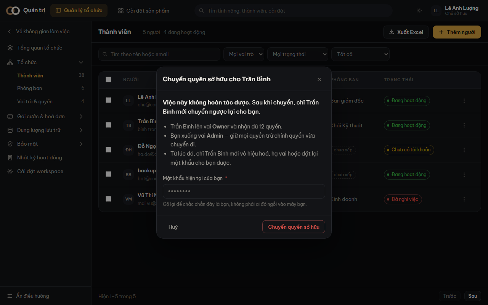

Chủ sở hữu là người đăng ký workspace, và là người **duy nhất** chuyển nhượng được nó.
Khi họ nghỉ việc, đổi vai trò trong công ty, hoặc chỉ đơn giản là không còn quản trị nữa,
đây là đường bàn giao.

## Các bước

1. Vào **Quản trị → Thành viên**, mở **chi tiết** người sẽ nhận.
2. Kéo xuống khối **Quyền sở hữu workspace** (dưới cùng, chỉ chủ sở hữu mới thấy).
3. Bấm **Chuyển quyền sở hữu**, đọc kỹ ba dòng hậu quả.
4. Gõ lại **mật khẩu hiện tại của bạn**, rồi xác nhận.

> [!canh] **Việc này không hoàn tác được.** Sau khi chuyển, chỉ người nhận mới chuyển ngược
> lại cho bạn. Nếu họ không làm, không ai trong workspace sửa được — kể cả bạn.

## Chuyện gì xảy ra

| Ai | Trước | Sau |
|---|---|---|
| Người nhận | Vai cũ của họ | **Owner**, đủ 12 quyền |
| Bạn | Owner | **Admin** — mọi quyền trừ chính quyền vừa chuyển đi |

Từ lúc đó, chỉ người nhận mới **vô hiệu hoá**, **hạ vai** hoặc **đặt lại mật khẩu** cho bạn
được. Đó chính là bốn thao tác mà hệ thống vẫn từ chối khi mục tiêu là chủ sở hữu.

## Bốn ca hệ thống từ chối

**Bạn không phải chủ sở hữu.** Khối này không hiện ra với ai khác. Kể cả khi vừa mất quyền
sở hữu mà phiên đăng nhập còn cũ, hệ thống vẫn đọc lại từ dữ liệu gốc và từ chối.

**Chuyển cho chính mình.** Không có gì để làm.

**Người nhận đang bị vô hiệu hoá.** Chuyển xong thì bạn mất quyền còn họ không đăng nhập
được — workspace còn chủ trên giấy tờ mà không ai vào được chỗ đó.

**Sai mật khẩu hiện tại.** Ô mật khẩu không phải thủ tục. Nó chặn đúng một ca rất cụ thể:
một cái máy bỏ quên lúc đang đăng nhập, và người ngồi xuống sau đó.

## Vì sao bạn xuống Admin chứ không phải Member

Bạn vừa là chủ công ty. Hạ thẳng xuống vai hẹp nhất là lấy mất khả năng làm việc của bạn
trong một cú bấm. **Admin** thiếu đúng một quyền so với **Owner** — chính quyền vừa chuyển
đi.

> [!luuy] Muốn nhận lại thì người kia vào đúng màn này và chuyển ngược. Nếu họ đã rời công
> ty mà chưa chuyển lại, xem [Đặt lại mật khẩu hộ đồng nghiệp](#dat-lai-mat-khau) — nhưng
> lưu ý mật khẩu của **chủ sở hữu** thì không ai đặt lại hộ được.
